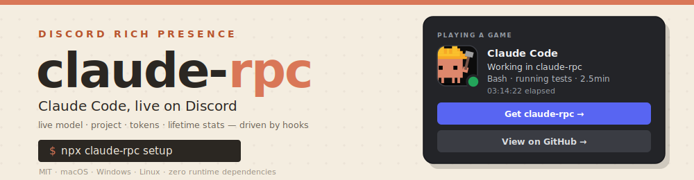
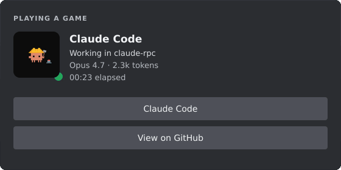
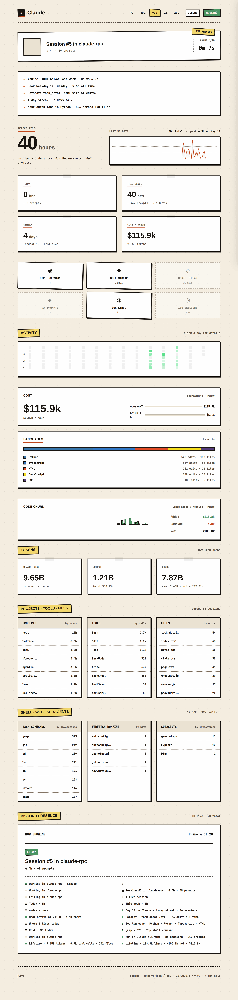
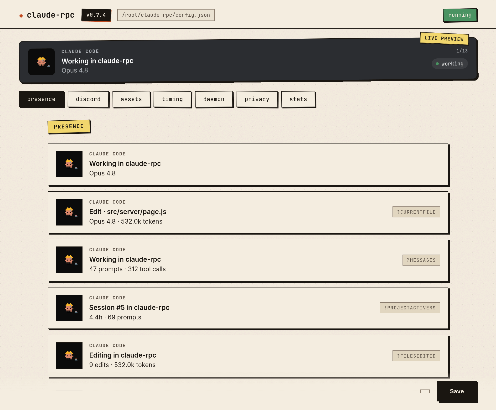

<div align="center">



<br/><br/>


<sub>the card's live states — <b>working</b> · <b>thinking</b> · <b>waiting</b> · <b>idle</b></sub>

<br/>

**Discord Rich Presence for [Claude Code](https://claude.com/claude-code)** — your live model, project, tokens, and lifetime stats, driven by the hooks Claude Code already fires.

**[claude-rpc.com →](https://claude-rpc.com)** — see it in one page.

[](#community-totals) &nbsp; [](#community-totals)

<sub>live — on by default for fresh installs, opt out any time. see [community totals](#community-totals)</sub>

[](LICENSE)
[](https://nodejs.org)
[](https://claude.com/claude-code)
[](https://discord.com/developers/docs/topics/rpc)
[](https://github.com/rar-file/claude-rpc/releases/latest)
[](https://www.npmjs.com/package/claude-rpc)

</div>

---

<div align="center">
  
</div>

A small Node daemon that takes the lifecycle events Claude Code already fires and pipes them into the Discord rich-presence card on your profile. Your friends see what you're building; your future self gets lifetime stats. Built solo, on weekends.

## install

**macOS / Linux / any Node 18+** — one command:

```sh
npx claude-rpc@latest setup
```

(The `@latest` matters — bare `npx claude-rpc` will happily reuse a stale cached copy.)

That installs `claude-rpc` globally, wires the hooks into Claude Code, and starts the daemon — no separate `start` step. Open Claude Code in any project and the card appears within a second. Something looks wrong? `claude-rpc doctor` (or `claude-rpc doctor --fix` to auto-repair).

**Prefer a one-liner that figures it out for you?**

```sh
curl -fsSL https://claude-rpc.com/install | sh
```

Detects Node (installs the npm package) or falls back to the prebuilt Apple-Silicon binary, then runs `setup` for you.

**Homebrew** (macOS / Linux):

```sh
brew install rar-file/claude-rpc/claude-rpc && claude-rpc setup
```

**Windows (no Node required)** — [grab the portable exe from the latest release](https://github.com/rar-file/claude-rpc/releases/latest), then:

```sh
claude-rpc setup
```

That's the whole pitch.

> `setup` registers a Windows startup entry and wires hooks into Claude Code's `settings.json`, and the daemon reports anonymous totals by default. All of it is reversible (`claude-rpc uninstall`, `community off`) and fully documented in [`SECURITY.md`](SECURITY.md) — read it first if you want to know exactly what runs.

The Discord *desktop* app must be running. The browser client doesn't expose the local IPC bridge that Rich Presence uses.

<details>
<summary><b>other platforms / from source</b></summary>

```sh
git clone https://github.com/rar-file/claude-rpc.git
cd claude-rpc
npm install
node ./src/cli.js setup     # wires hooks + starts the daemon
```

Or `npm install -g claude-rpc && claude-rpc setup` for the global bin. `setup` starts the daemon for you; manage it afterward with `claude-rpc start | stop | status`. Every mode survives `npm update` without losing your `clientId` — user config lives under the per-OS config dir, not inside `node_modules`.
</details>

<details>
<summary><b>use your own Discord app</b></summary>

A working public Discord application is bundled into the default config — you don't need to register your own to get started. If you want a different app name on the card, create one in the [Discord Developer Portal](https://discord.com/developers/applications), copy the Application ID, and drop it into your config:

```sh
# Linux
echo '{ "clientId": "YOUR_ID" }' > ~/.config/claude-rpc/config.json
# macOS
echo '{ "clientId": "YOUR_ID" }' > ~/Library/Application\ Support/claude-rpc/config.json
# Windows (PowerShell)
'{ "clientId": "YOUR_ID" }' | Set-Content $env:APPDATA\claude-rpc\config.json
```

`claude-rpc upgrade-config` if you're carrying forward a v0.3-era file.
</details>

## what claude-rpc does

### on discord

A card that updates as you work. The large image swaps between five states (working / thinking / idle / stale / notification — those gifs at the top of this README). The two lines of text rotate through frames you template — current file, today's hours, lifetime totals, top hotspot, code churn, cost — and the daemon skips frames whose required template variables are empty. The `SessionEnd` hook clears the card instantly when you close Claude Code; no "is it still running?" timeout.

A *View on GitHub →* button appears automatically when your cwd is a git repo with a github origin. The daemon checks `.git/config` directly — no shell-out, no surprise GH API call.

A rotation frame can show your **subscription usage** — `Usage · 34% weekly` — the exact numbers Claude Code's own `/usage` screen shows. The daemon asks Anthropic's usage endpoint with the OAuth token Claude Code already stores locally; the token goes only to its issuer, the percentages go only where you template them, and `usage.enabled: false` turns the whole thing off ([`SECURITY.md` §3d](SECURITY.md)). `claude-rpc usage` prints the same data as heat-graded bars in your terminal.

### on your machine

Three local surfaces, all reading the same `~/.claude-rpc/aggregate.json`:

<table>
<tr>
<td align="center" width="50%"><b>web dashboard</b><br/><sub><code>claude-rpc serve</code> · port 47474</sub><br/><br/></td>
<td align="center" width="50%"><b>settings gui</b><br/><sub><code>npm run dashboard</code> · Electron</sub><br/><br/></td>
</tr>
</table>

```text
claude-rpc status                 (TUI — heatmap, hour histogram, leaderboards)
claude-rpc today                  (today's stats, focused)
claude-rpc week                   (weekday breakdown)
claude-rpc preview                (every rotation frame rendered with real data)
claude-rpc insights               (3–5 auto-generated lines: trend, peak, hotspot)
```

The web dashboard pushes updates via SSE; the TUI refreshes on a 3-second tick.

### beyond your machine

Shields-style badges and a poster-style summary card you can paste into a README or a Discord message. The fastest path is one command:

```sh
claude-rpc readme                 # prints paste-ready README badge markdown
claude-rpc readme --raw | pbcopy  # straight to your clipboard
```

**Live card + badges, paste once.** With a public profile (`claude-rpc profile set --handle <you> && claude-rpc profile on`), your stats are served as an always-current card (and badges) from the community worker — no `gh`, no gist, nothing to re-run:

```md
[](https://claude-rpc.com/u/<you>)

[](https://claude-rpc.com/?ref=badge)
```

The card shows tokens, sessions, active hours and streak; badge `metric=` is one of `tokens · sessions · hours · streak` (optional `&label=` to retitle). Both refresh themselves as the daemon flushes your profile (~every 30 min). Your profile page at `/u/<you>` has a one-click "copy" for the whole block.

Prefer to render locally? `badge`/`card`/`calendar`/`github-stat` all write SVG, and `--gist` self-hosts a live one:

```sh
claude-rpc badge --metric hours  --range 7d   --out claude-hours.svg
claude-rpc badge --metric streak              --out claude-streak.svg
claude-rpc badge --metric hours  --gist                                     # publish to a gist (live README badge)
claude-rpc card  --range year                 --out year-on-claude.svg
```

<div align="center">
  
  
  
  <br/>
  <sub><code>card --range week · month · year</code> (also <code>all</code>) — live at <code>/api/card.svg</code> while the daemon's up</sub>
</div>

`badge --gist` writes the SVG to your own GitHub gist (creates one on first run, updates it after — id remembered in `config.json`). The URL printed back is README-ready and updates every time you re-run the command. Uses `gh` if available, else `GH_TOKEN` with `gist` scope.

Live equivalents when the daemon is up:

- `http://127.0.0.1:47474/api/badge.svg?metric=hours&range=7d`
- `http://127.0.0.1:47474/api/card.svg?range=year`

Cost numbers come from `src/pricing.js`, seeded with **approximate** public list prices. Your actual Claude Code subscription bill is unrelated.

### community totals

The badges at the top of this README are live, served by a small Cloudflare Worker ([`worker/`](worker/)) that holds running totals of sessions and tokens across every install that's reporting. As of v0.7 **fresh installs are on by default** — `setup` mints an anonymous UUID v4 and the daemon starts flushing deltas every 30 minutes. Existing users upgrading from a pre-v0.7 config stay off until they explicitly run `community on` (the consent flow prints the exact payload first).

```sh
claude-rpc community              # show state + instanceId (last 8 chars)
claude-rpc community off          # opt out; instanceId retained for re-enable continuity
claude-rpc community on           # explicit consent flow (upgraders / re-enable)
claude-rpc community report       # one-shot manual flush (testing)
```

Each report sends only: a `sessionsDelta`, a `tokensDelta`, the claude-rpc version, OS family (`linux`/`darwin`/`win32`), and the anonymous UUID v4. No prompts, paths, models, repos, costs, usernames, or hostnames — the Worker's [`validateReport`](worker/src/index.js) is the schema of record. The full Worker source is in this repo so the privacy claim is auditable. Every worker route — path, params, response — is documented in [`docs/WORKER-API.md`](docs/WORKER-API.md).

For a complete account of the sensitive things claude-rpc does — startup persistence, hook injection, every outbound request, and the exact telemetry payload — see [`SECURITY.md`](SECURITY.md). It's also the reference for supply-chain scanner findings (Socket.dev et al.): the flagged persistence and hook-injection behaviors are inherent to the tool and documented there.

## three pieces, glued by json files

<div align="center">
  
</div>

No database, no message bus, no background polling when Claude Code isn't running. State on disk you can `cat` and `jq`. **Zero runtime dependencies** — even the Discord Rich Presence IPC client is hand-rolled (`src/discord-ipc.js`).

1. **hook** ([`src/hook.js`](src/hook.js)) — Claude Code spawns it on every lifecycle event. Parses the JSON from stdin and mutates the shared state file. Runs in ~20ms.
2. **daemon** ([`src/daemon.js`](src/daemon.js)) — long-running. Connects to Discord's local IPC, watches the state file, pushes presence frames every few seconds. Exponential backoff with jitter on reconnect; `daemon.log` rotates at 5 MB.
3. **scanner** ([`src/scanner.js`](src/scanner.js)) — walks `~/.claude/projects/**/*.jsonl` for all-time aggregates (active time, prompts, tools, tokens, streaks, hotspots, lines, languages, cost, bash, web, subagents). Incremental — re-parses only changed files.

Persistent state, all human-readable JSON:

| Path | What |
| ---- | ---- |
| `$TMPDIR/claude-rpc/state.json` | Current session, volatile |
| `~/.claude-rpc/aggregate.json` | All-time aggregates |
| `~/.claude-rpc/scan-cache.json` | Per-transcript scan cache |
| `~/.claude-rpc/private-list.json` | Runtime privacy toggles |
| `~/.claude/settings.json` | Hook registrations (managed by `setup`) |

User config lives at `%APPDATA%\claude-rpc\config.json` (Windows), `~/Library/Application Support/claude-rpc/config.json` (macOS), or `$XDG_CONFIG_HOME/claude-rpc/config.json` (Linux). It only needs to hold *overrides* — every key has a baked default. `{ "clientId": "..." }` is a complete config file. Defaults live in [`src/default-config.js`](src/default-config.js); the loader deep-merges over them.

## privacy

Per-project, runtime, or auto-detected — whichever fits how you work.

```jsonc
// drop at your project root: <project>/.claude-rpc.json
{ "private": true }                                  // shortcut for visibility: "hidden"
{ "visibility": "name-only" }                        // project name only, no file/tool detail
{ "projectName": "redacted" }                        // show this name on Discord instead
```

Or from the command line, in any project:

```sh
claude-rpc private        # add cwd to ~/.claude-rpc/private-list.json
claude-rpc public         # remove cwd
claude-rpc privacy        # show the resolved visibility for the current dir
```

Or globally, in `config.json`:

```json
{ "privacy": { "patterns": ["client-*", "secret-stuff"], "mode": "hidden" } }
```

If [`gh`](https://cli.github.com/) is installed and authenticated, GitHub-private repos auto-hide (`privacy.githubPrivateMode`, default `hidden` — opt out with `privacy.autoDetectGithubPrivate: false`). 5-minute cache, 1.5s timeout, silent skip when `gh` isn't there.

Aggregates and local dashboards are never affected. Privacy is a one-way valve between local state and Discord.

## customizing the card

```sh
claude-rpc preview        # render every rotation frame with your real data
claude-rpc vars           # dump the full template-variable list as JSON
```

Frames have a `requires` field; the daemon skips a frame when any of its required vars resolve empty / zero. Write seven frames knowing only the relevant ones render.

```jsonc
"idle": {
  "details": "Idle in {project}",
  "state":   "{modelPretty} · {todayHours} today",
  "rotation": [
    { "details": "This week · {weekHours}",      "state": "{weekPromptsLabel} · {weekTokensFmt} tokens",
      "requires": ["weekActiveMs"] },
    { "details": "Code churn · {linesAddedFmt} added",
      "state":   "{linesNetFmt} net · {topLanguage}",
      "requires": ["topLanguage"] }
  ]
}
```

The full default config is in [`src/default-config.js`](src/default-config.js) — that's the canonical list of every key. Over 200 template variables are available; `claude-rpc vars` is the authoritative list.

## claude code plugin

Prefer to install from inside Claude Code? There's a [plugin](plugin/) for that:

```text
/plugin marketplace add rar-file/claude-rpc
/plugin install claude-rpc@claude-rpc
```

It's a thin bootstrapper — on the first session it just runs `npx claude-rpc@latest setup` for you (the same install as above), then stays out of the way. macOS / Linux / WSL; on Windows use the portable exe. Nothing extra is added to your sessions — the plugin is a single `SessionStart` hook with no model-context cost.

## commands

`claude-rpc --help` lists them all — and after `setup` you rarely need any.

<details>
<summary><b>full command reference</b></summary>

<br/>

| Command          | What it does |
| ---------------- | ------------ |
| `setup`          | Install Claude Code hooks (test-fires one synthetic SessionStart to prove the pipe works) |
| `uninstall`      | Remove Claude Code hooks |
| `upgrade-config` | Re-run idempotent migrations on `config.json` |
| `start` / `stop` / `restart` | Lifecycle for the detached daemon |
| `status`         | Interactive TUI — heatmap, hour histogram, leaderboards (`--dump` for plain output) |
| `today` / `week` | Focused views (today's stats, weekday breakdown) |
| `usage`          | Subscription limits — session + weekly %, the same numbers `/usage` shows |
| `serve`          | Open the local web dashboard (port 47474) |
| `preview`        | Render every rotation frame against real state |
| `scan` / `rescan`| Incremental / forced re-parse of `~/.claude/projects` |
| `backfill <dir>` | Import transcripts from any folder (backup, other machine) |
| `insights`       | Print 3–5 auto-generated lines about your week |
| `badge`          | Shields-style SVG (`--metric` `--range` `--out` `--gist`) |
| `card`           | Poster-style SVG (`--range year\|month\|week\|all`) |
| `github-stat`    | Embeddable profile stat card (`--handle` `--out` `--gist`) |
| `calendar`       | Year activity heatmap SVG (`--out` `--gist`) |
| `session-card`   | Recap card for the current session (`--out`) |
| `readme`         | Paste-ready README badge markdown for your profile (`--raw` to pipe) |
| `statusline`     | One-line status for tmux/shell prompts (`--template`) |
| `mcp install`    | Wire the stats MCP server into Claude Code (one command) |
| `mcp`            | Run the MCP server (stdio) for Claude Code |
| `wrapped`        | Open your animated year-in-review (Claude Wrapped) |
| `private` / `public` / `privacy` | Per-cwd visibility toggles + status |
| `community`      | Opt-in community totals — `on` \| `off` \| `status` \| `report` |
| `doctor`         | Diagnostic checklist with one-line fix hints |
| `tail` / `logs`  | Tail the daemon log |
| `daemon`         | Run the daemon in the foreground (debugging) |
| `vars`           | Dump the full template-var list as JSON |

Exit codes: `0` ok · `1` user error · `2` system error · `3` wrong state. `--version` and `--help` work as expected.

</details>

<details>
<summary><b>complete removal</b></summary>

<br/>

`claude-rpc uninstall` removes everything that *respawns or registers* the tool:
its hooks from `~/.claude/settings.json` (only its own — third-party hooks are
left untouched) and the login-autostart entry (`systemd --user` unit on Linux,
LaunchAgent on macOS, `HKCU\…\Run` value + `.vbs` shim on Windows). After it
runs, nothing brings the daemon back.

It deliberately **leaves your data in place**: `config.json` (under the per-OS
config dir), the stats in `~/.claude-rpc/`, and the transient files in the temp
dir (which clear on reboot anyway). Two things it does *not* touch, by design:

- a daemon already running this session keeps running until `claude-rpc stop` or
  reboot (the autostart-managed one is stopped; a manually `start`ed one isn't);
- the MCP server, if you wired it — that's a separate `claude-rpc mcp uninstall`.

For a clean wipe on macOS/Linux:

```sh
claude-rpc mcp uninstall   # only if you ran `mcp install`
claude-rpc stop
claude-rpc uninstall
rm -rf ~/.claude-rpc        # stats; plus the per-OS config dir if you want it gone
```

</details>

## troubleshooting

**First step is always `claude-rpc doctor`** — it checks Node, hook registration, daemon liveness, Discord IPC, aggregate freshness, and privacy resolution, with a one-line fix hint per failure.

<details>
<summary><b>common issues</b></summary>

<br/>

- **Discord doesn't show anything.** Discord *desktop* must be running. The browser client doesn't expose the local IPC bridge. `claude-rpc tail` shows what the daemon is actually doing.
- **Hooks don't fire.** `claude-rpc setup` re-registers them and now test-fires a synthetic `SessionStart` end-to-end, so a broken hook command surfaces immediately. Restart Claude Code afterwards so it re-reads its hook config.
- **Config error.** Bad JSON in `config.json` no longer crashes anything — the daemon logs one line and falls back to baked defaults. `claude-rpc tail` shows the parse error verbatim.
- **Old binary path baked into hooks.** Common after manual exe replacement. `claude-rpc setup` rewrites hook entries to point at the canonical install location.

</details>

## platform support

**macOS and Linux are first-class.** The daemon reacts to on-disk changes with a
directory watcher (`fs.watch` over FSEvents/inotify — instant) *and* an mtime
poll as a lazy backstop, so an event is never missed. Login autostart is a
per-user [`launchd` LaunchAgent](src/install.js) on macOS and a
[`systemd --user` service](src/install.js) on Linux; both start the daemon at
login without `sudo` and don't fight a manual `claude-rpc stop`.

**Windows is supported** — grab the portable exe (no Node required), then
`claude-rpc setup`. One caveat documented honestly: `fs.watch` on Windows drops
events when a writer commits via atomic rename (which the state file, pause file,
scanner, and settings GUI all do), so on Windows the **mtime poll is effectively
the primary path** and runs an order of magnitude faster (every ~3s vs ~30s
elsewhere) to compensate. It's a reliable fallback, not yet the native-watch
confidence macOS/Linux get — closing that gap is on the [roadmap](ROADMAP.md).
Autostart is an `HKCU\…\Run` entry launched through a windowless `.vbs` shim (no
scheduled task, by design — see [`SECURITY.md`](SECURITY.md)).

Everything else — the scanner, dashboards, cards, the worker client — is
platform-neutral. CI runs the full suite on Node 18/20/22 and builds the macOS
and Windows binaries every release.

## versioning

What's a stable contract and what's an internal detail you shouldn't build on:
[`VERSIONING.md`](VERSIONING.md). Short version — the worker HTTP API, the CLI
(commands, flags, exit codes), the `config.json` schema, the `claude-rpc vars`
template variables, and the local data formats are stable and semver-governed;
daemon internals, the scan cache, the worker's KV layout, and exact wording are
not. The worker's HTTP surface is documented in
[`docs/WORKER-API.md`](docs/WORKER-API.md).

## development

```sh
npm test                  # 430+ tests, ~2s
npm run lint              # eslint over src + test
npm run start             # run daemon in foreground
npm run serve             # web dashboard against your real data
npm run dashboard         # Electron settings GUI (dev mode)
npm run build:exe         # SEA single-file binary for the current OS
```

Tests are `node --test`, zero deps; CI ([release.yml](.github/workflows/release.yml)) runs the suite (+ the Worker's) across Node 18/20/22 and gates the matrix build and npm publish. Where the project's headed (and what it'll deliberately never do): [`ROADMAP.md`](ROADMAP.md).

## license

[MIT](LICENSE) © Archer Simmons
